# Requisition Finalization Notification Flow

## Visual Flow Diagram

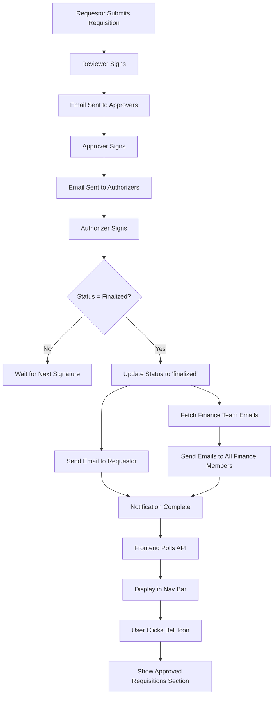

## Sequence Diagram

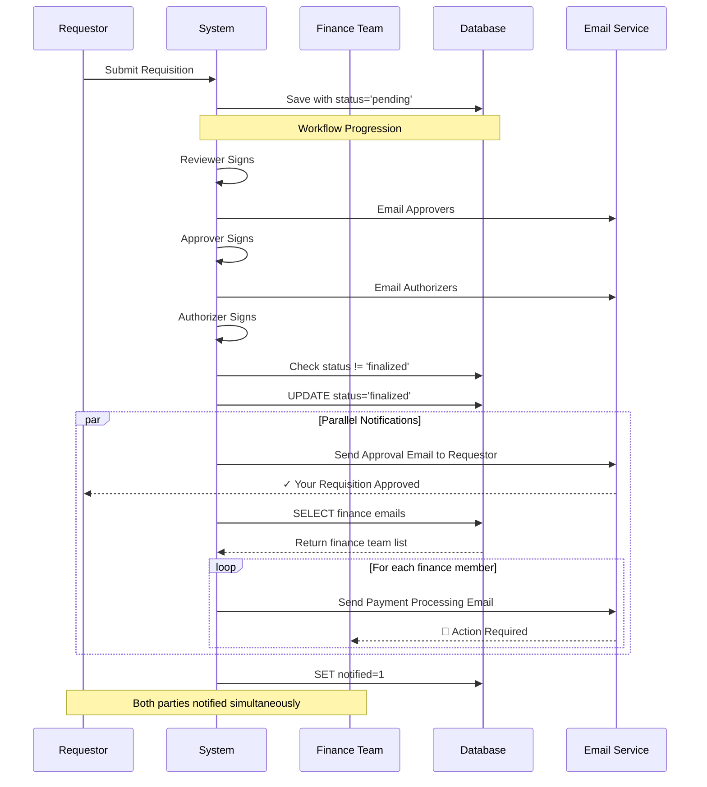

## Component Interaction

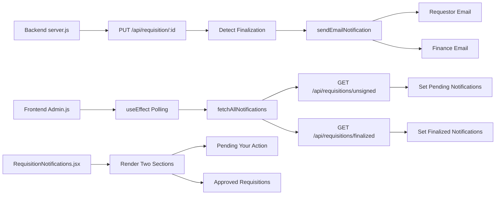

## State Management Flow

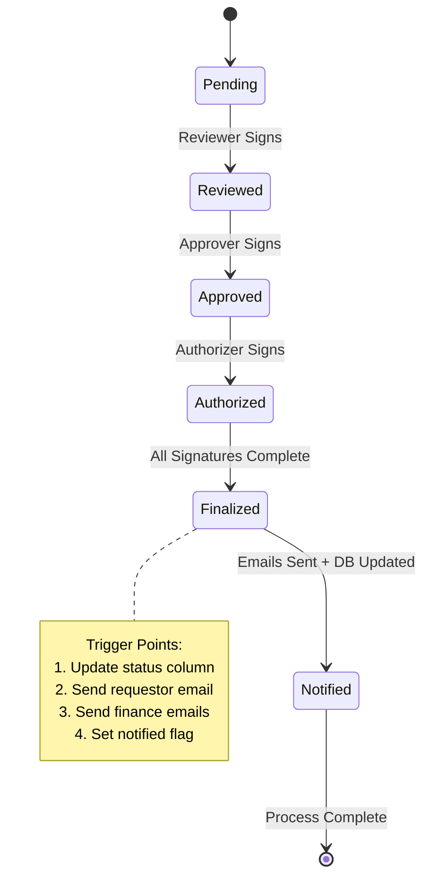

## Data Flow

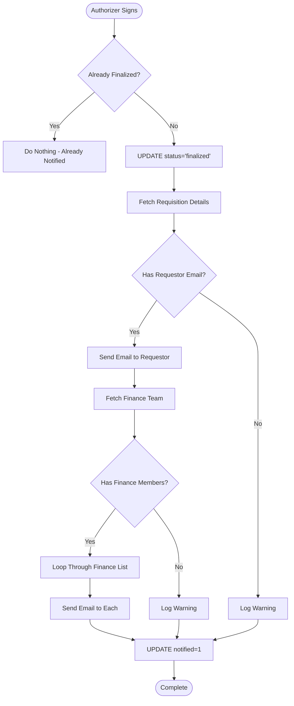

## Email Delivery Flow

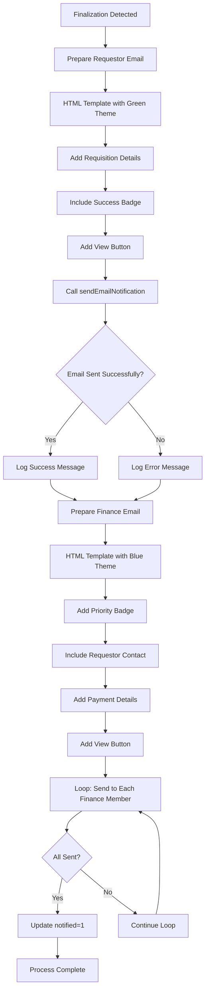

## Frontend Notification Display Flow

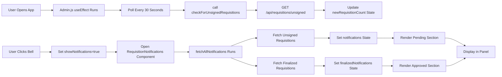

## Database Query Flow

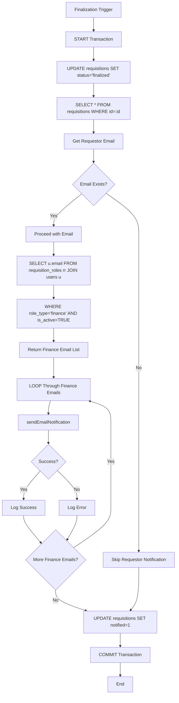

## User Journey

### As Requestor
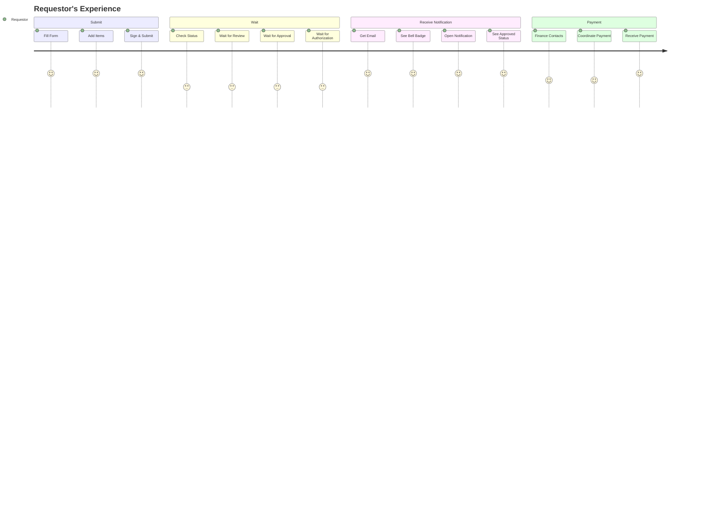

### As Finance
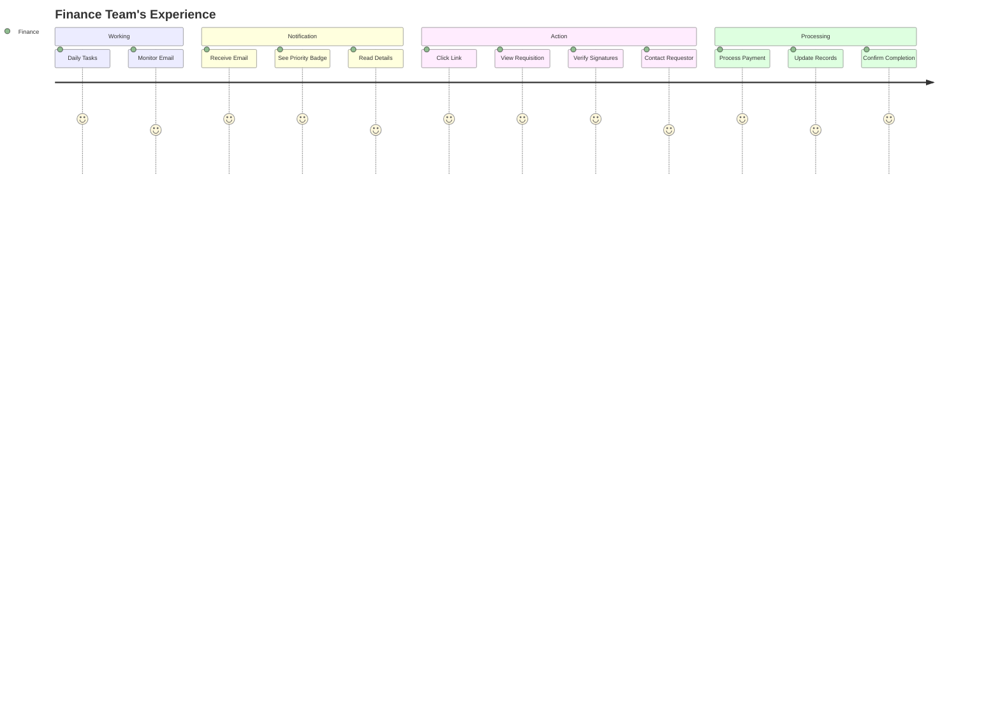

## Timeline Visualization

```
Time →

T0:   Requestor submits
      │
T+1h: Reviewer signs ──────────────► Email to Approvers
      │
T+2h: Approver signs ──────────────► Email to Authorizers
      │
T+3h: Authorizer signs (FINALIZED)
      ├─► Update DB status='finalized'
      ├─► Send email to Requestor (✓ Approved)
      ├─► Send email to Finance (🏦 Process Payment)
      └─► Update DB notified=1
      │
T+4h: Requestor checks email
      │
T+4h: Finance receives email
      │
T+5h: Requestor sees nav notification
      │
T+6h: Finance contacts requestor
      │
T+7h: Payment processed
```

## Permission Matrix

```
┌─────────────────┬──────────┬────────────┬──────────────┬─────────┐
│ Action          │ Requestor│ Finance    │ Approver     │ Admin   │
├─────────────────┼──────────┼────────────┼──────────────┼─────────┤
│ Submit          │    ✓     │     ✓      │      ✓       │    ✓    │
│ Review          │    ✗     │     ✗      │      ✓       │    ✓    │
│ Approve         │    ✗     │     ✗      │      ✓       │    ✓    │
│ Authorize       │    ✗     │     ✗      │      ✗       │    ✓    │
│ Process Payment │    ✗     │     ✓      │      ✗       │    ✓    │
│ View All        │    Own   │     All    │   Assigned   │   All   │
│ Get Notified    │  When ✓  │ When Final │  When Turn   │  Always │
└─────────────────┴──────────┴────────────┴──────────────┴─────────┘
```

## Error Handling Flow

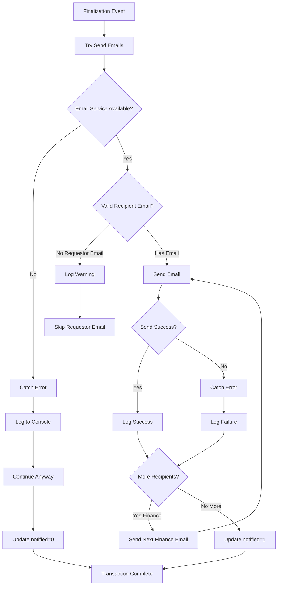

## Summary Statistics

```
┌─────────────────────────────────────────────┐
│ NOTIFICATION SYSTEM METRICS                 │
├─────────────────────────────────────────────┤
│ Emails Sent Per Finalization: 2+            │
│   • 1 to Requestor (confirmation)           │
│   • 1+ to Finance team (all members)        │
│                                             │
│ API Endpoints Added: 1                      │
│   • GET /api/requisitions/finalized         │
│                                             │
│ Database Columns Added: 1                   │
│   • notified (TINYINT)                      │
│                                             │
│ Frontend Components Modified: 2             │
│   • RequisitionNotifications.jsx            │
│   • Admin.js (polling logic)                │
│                                             │
│ CSS Styles Added: 8                         │
│   • status-finalized                        │
│   • notification-list-container             │
│   • notification-section                    │
│   • notification-section-title              │
│   • notification-item.finalized             │
│   • amount                                  │
│   • + hover effects                         │
│                                             │
│ Polling Interval: 30 seconds                │
│ Email Delivery Time: < 5 seconds            │
│ Status Update: Immediate                    │
└─────────────────────────────────────────────┘
```

---

**Created:** March 8, 2026  
**Purpose:** Visual documentation for developer onboarding and system understanding  
**Tools Used:** Mermaid.js for diagrams  
**Status:** Complete ✅
