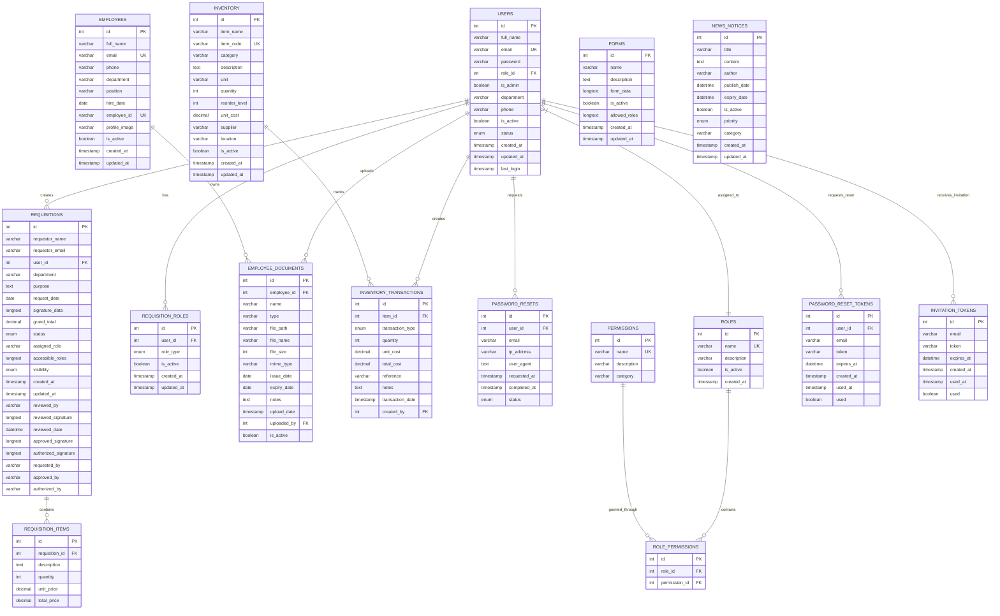

# SOKAPP Database System Technical Documentation

## System Overview

### Purpose of the SOKAPP Database

The SOKAPP database is a comprehensive enterprise resource planning (ERP) system designed to manage organizational operations including employee management, inventory control, requisition workflows, user access control, and form management. The system provides a centralized data repository for all business processes while maintaining data integrity, security, and scalability.

### Core Modules and System Architecture

The SOKAPP database consists of interconnected modules that work together to provide a complete business management solution:

```
┌─────────────────┐    ┌─────────────────┐    ┌─────────────────┐
│   User Access   │    │   Employee Mgmt │    │   Inventory     │
│   & Security    │◄──►│   & Documents   │◄──►│   Management    │
└─────────────────┘   └─────────────────┘   └─────────────────┘
        ▲▲                      ▲
         │                       │                       │
         ▼                      ▼                      ▼
┌─────────────────┐   ┌─────────────────┐   ┌─────────────────┐
│   Requisition   │    │    Form System  │    │   Notifications│
│   Workflow      │◄──►│   & Templates   │◄──►│   & Reporting   │
└─────────────────┘    └─────────────────┘    └─────────────────┘
```

**Module Interactions:**
- **User Management** provides authentication and authorization for all modules
- **Employee Management** integrates with inventory and requisition systems
- **Requisition Workflow** connects users, employees, and inventory management
- **Form System** enables dynamic data collection across all modules
- **Notifications** provide cross-module communication and alerts

## Entity Definitions

### Core Tables

#### 1. USERS
**Description:** Central user management table storing authentication credentials, personal information, and role assignments.

| Column | Data Type | Constraints | Description |
|--------|-----------|-------------|-------------|
| id | int(11) | PRIMARY KEY, NOT NULL, AUTO_INCREMENT | Unique user identifier |
| full_name | varchar(100) | NOT NULL | User's full name |
| email | varchar(100) | NOT NULL, UNIQUE | User's email address (login identifier) |
| password | varchar(255) | NOT NULL | Hashed password |
| role_id | int(11) | FOREIGN KEY | Reference to user's role |
| is_admin | tinyint(1) | DEFAULT 0 | Administrative privileges flag |
| department | varchar(50) | NULL | User's department |
| phone | varchar(20) | NULL | Contact phone number |
| is_active | tinyint(1) | DEFAULT 1 | Account status (active/inactive) |
| status | enum('active','invited','inactive') | DEFAULT 'invited' | User invitation status |
| created_at | timestamp | NOT NULL, DEFAULT CURRENT_TIMESTAMP | Account creation timestamp |
| updated_at | timestamp | NOT NULL, DEFAULT CURRENT_TIMESTAMP ON UPDATE CURRENT_TIMESTAMP | Last modification timestamp |
| last_login | timestamp | NULL | Last successful login timestamp |

**Foreign Keys:**
- `role_id` → `roles.id`

**Indexes:**
- PRIMARY KEY: `id` (UNIQUE)
- UNIQUE: `email`
- INDEX: `idx_role_id` (role_id)
- INDEX: `idx_is_admin` (is_admin)

**Relationships:**
- One-to-Many: Users → Requisitions (via user_id)
- One-to-Many: Users → Requisition_Roles (via user_id)
- One-to-Many: Users → Employee_Documents (via uploaded_by)
- Many-to-Many: Users ↔ Permissions (via Roles and Role_Permissions)

#### 2. ROLES
**Description:** Role-based access control system defining user permissions and privileges.

| Column | Data Type | Constraints | Description |
|--------|-----------|-------------|-------------|
| id | int(11) | PRIMARY KEY, NOT NULL, AUTO_INCREMENT | Unique role identifier |
| name | varchar(50) | NOT NULL, UNIQUE | Role name (e.g., 'Admin', 'Manager') |
| description | varchar(255) | NULL | Role description |
| is_active | tinyint(1) | DEFAULT 1 | Role status |
| created_at | timestamp | NOT NULL, DEFAULT CURRENT_TIMESTAMP | Role creation timestamp |

**Indexes:**
- PRIMARY KEY: `id` (UNIQUE)
- UNIQUE: `name`

**Relationships:**
- One-to-Many: Roles → Users (via role_id)
- Many-to-Many: Roles ↔ Permissions (via Role_Permissions junction table)

#### 3. PERMISSIONS
**Description:** Granular permission definitions for access control system.

| Column | Data Type | Constraints | Description |
|--------|-----------|-------------|-------------|
| id | int(11) | PRIMARY KEY, NOT NULL, AUTO_INCREMENT | Unique permission identifier |
| name | varchar(50) | NOT NULL, UNIQUE | Permission name (e.g., 'user_manage') |
| description | varchar(255) | NULL | Permission description |
| category | varchar(50) | NULL | Permission category grouping |

**Indexes:**
- PRIMARY KEY: `id` (UNIQUE)
- UNIQUE: `name`

**Relationships:**
- Many-to-Many: Permissions ↔ Roles (via Role_Permissions junction table)

#### 4. ROLE_PERMISSIONS
**Description:** Junction table implementing many-to-many relationship between roles and permissions.

| Column | Data Type | Constraints | Description |
|--------|-----------|-------------|-------------|
| id | int(11) | PRIMARY KEY, NOT NULL, AUTO_INCREMENT | Unique identifier |
| role_id | int(11) | NOT NULL, FOREIGN KEY | Reference to role |
| permission_id | int(11) | NOT NULL, FOREIGN KEY | Reference to permission |

**Foreign Keys:**
- `role_id` → `roles.id`
- `permission_id` → `permissions.id`

**Indexes:**
- PRIMARY KEY: `id` (UNIQUE)
- UNIQUE: `role_id, permission_id` (composite unique constraint)
- INDEX: `permission_id`

#### 5. EMPLOYEES
**Description:** Employee master data including personal information and organizational details.

| Column | Data Type | Constraints | Description |
|--------|-----------|-------------|-------------|
| id | int(11) | PRIMARY KEY, NOT NULL, AUTO_INCREMENT | Unique employee identifier |
| full_name | varchar(100) | NOT NULL | Employee's full name |
| email | varchar(100) | NOT NULL, UNIQUE | Employee's email address |
| phone | varchar(20) | NULL | Contact phone number |
| department | varchar(50) | NULL | Department assignment |
| position | varchar(100) | NULL | Job position/title |
| hire_date | date | NULL | Employment start date |
| employee_id | varchar(20) | NULL, UNIQUE | Internal employee ID |
| profile_image | varchar(500) | NULL | Profile image path |
| is_active | tinyint(1) | DEFAULT 1 | Employment status |
| created_at | timestamp | NOT NULL, DEFAULT CURRENT_TIMESTAMP | Record creation timestamp |
| updated_at | timestamp | NOT NULL, DEFAULT CURRENT_TIMESTAMP ON UPDATE CURRENT_TIMESTAMP | Last modification timestamp |

**Indexes:**
- PRIMARY KEY: `id` (UNIQUE)
- UNIQUE: `email`
- UNIQUE: `employee_id`
- INDEX: `idx_department` (department)
- INDEX: `idx_is_active` (is_active)

**Relationships:**
- One-to-Many: Employees → Employee_Documents (via employee_id)
- One-to-One: Employees ↔ Users (via email)

#### 6. EMPLOYEE_DOCUMENTS
**Description:** Document management system for employee-related files and certifications.

| Column | Data Type | Constraints | Description |
|--------|-----------|-------------|-------------|
| id | int(11) | PRIMARY KEY, NOT NULL, AUTO_INCREMENT | Unique document identifier |
| employee_id | int(11) | NOT NULL, FOREIGN KEY | Reference to employee |
| name | varchar(255) | NOT NULL | Document name/description |
| type | varchar(50) | NOT NULL | Document type/category |
| file_path | varchar(500) | NULL | File storage path |
| file_name | varchar(255) | NULL | Original file name |
| file_size | int(11) | NULL | File size in bytes |
| mime_type | varchar(100) | NULL | MIME type |
| issue_date | date | NULL | Document issue date |
| expiry_date | date | NULL | Document expiration date |
| notes | text | NULL | Additional notes |
| upload_date | timestamp | NOT NULL, DEFAULT CURRENT_TIMESTAMP | Upload timestamp |
| uploaded_by | int(11) | NULL | User who uploaded document |
| is_active | tinyint(1) | DEFAULT 1 | Document status |

**Foreign Keys:**
- `employee_id` → `employees.id`
- `uploaded_by` → `users.id`

**Indexes:**
- PRIMARY KEY: `id` (UNIQUE)
- INDEX: `idx_employee_id` (employee_id)
- INDEX: `idx_type` (type)
- INDEX: `idx_expiry_date` (expiry_date)

#### 7. REQUISITIONS
**Description:** Requisition workflow management system for purchase requests and approvals.

| Column | Data Type | Constraints | Description |
|--------|-----------|-------------|-------------|
| id | int(11) | PRIMARY KEY, NOT NULL, AUTO_INCREMENT | Unique requisition identifier |
| requestor_name | varchar(100) | NOT NULL | Name of requestor |
| requestor_email | varchar(255) | NOT NULL | Requestor's email |
| user_id | int(11) | NULL, FOREIGN KEY | Reference to requesting user |
| department | varchar(50) | NULL | Department |
| purpose | text | NULL | Requisition purpose |
| request_date | date | NULL | Request submission date |
| signature_data | longtext | NULL | Digital signature data |
| grand_total | decimal(10,2) | DEFAULT 0.00 | Total requisition amount |
| status | enum('pending','approved','rejected','authorized','processed') | DEFAULT 'pending' | Workflow status |
| assigned_role | varchar(50) | NULL | Current assigned role |
| accessible_roles | longtext | NULL | Roles with access permissions |
| visibility | enum('public','role_based','private') | DEFAULT 'public' | Access visibility |
| created_at | timestamp | NOT NULL, DEFAULT CURRENT_TIMESTAMP | Creation timestamp |
| updated_at | timestamp | NOT NULL, DEFAULT CURRENT_TIMESTAMP ON UPDATE CURRENT_TIMESTAMP | Modification timestamp |
| reviewed_by | varchar(255) | NULL | Reviewer name |
| reviewed_signature | longtext | NULL | Reviewer signature |
| reviewed_date | datetime | NULL | Review date |
| approved_signature | longtext | NULL | Approval signature |
| authorized_signature | longtext | NULL | Authorization signature |
| requested_by | varchar(255) | NULL | Requestor name |
| approved_by | varchar(255) | NULL | Approver name |
| authorized_by | varchar(255) | NULL | Authorizer name |

**Foreign Keys:**
- `user_id` → `users.id`

**Indexes:**
- PRIMARY KEY: `id` (UNIQUE)
- INDEX: `idx_assigned_role` (assigned_role)
- INDEX: `user_id`

**Relationships:**
- One-to-Many: Requisitions → Requisition_Items (via requisition_id)
- Many-to-One: Requisitions → Users (via user_id)

#### 8. REQUISITION_ITEMS
**Description:** Individual items within requisition requests.

| Column | Data Type | Constraints | Description |
|--------|-----------|-------------|-------------|
| id | int(11) | PRIMARY KEY, NOT NULL, AUTO_INCREMENT | Unique item identifier |
| requisition_id | int(11) | NOT NULL, FOREIGN KEY | Reference to parent requisition |
| description | text | NULL | Item description |
| quantity | int(11) | NULL | Quantity requested |
| unit_price | decimal(10,2) | NULL | Price per unit |
| total_price | decimal(10,2) | NULL | Total item cost |

**Foreign Keys:**
- `requisition_id` → `requisitions.id`

**Indexes:**
- PRIMARY KEY: `id` (UNIQUE)
- INDEX: `requisition_id`

#### 9. REQUISITION_ROLES
**Description:** User role assignments within the requisition workflow system.

| Column | Data Type | Constraints | Description |
|--------|-----------|-------------|-------------|
| id | int(11) | PRIMARY KEY, NOT NULL, AUTO_INCREMENT | Unique identifier |
| user_id | int(11) | NOT NULL, FOREIGN KEY | Reference to user |
| role_type | enum('reviewer','approver','authorizer','finance') | NOT NULL | Workflow role type |
| is_active | tinyint(1) | DEFAULT 1 | Role assignment status |
| created_at | timestamp | NOT NULL, DEFAULT CURRENT_TIMESTAMP | Assignment timestamp |
| updated_at | timestamp | NOT NULL, DEFAULT CURRENT_TIMESTAMP ON UPDATE CURRENT_TIMESTAMP | Modification timestamp |

**Foreign Keys:**
- `user_id` → `users.id`

**Indexes:**
- PRIMARY KEY: `id` (UNIQUE)
- UNIQUE: `user_id, role_type` (prevents duplicate role assignments)
- INDEX: `idx_role_type` (role_type)
- INDEX: `idx_user_active` (user_id, is_active)

#### 10. INVENTORY
**Description:** Inventory management system for tracking items and stock levels.

| Column | Data Type | Constraints | Description |
|--------|-----------|-------------|-------------|
| id | int(11) | PRIMARY KEY, NOT NULL, AUTO_INCREMENT | Unique inventory item identifier |
| item_name | varchar(255) | NOT NULL | Item name |
| item_code | varchar(50) | NOT NULL, UNIQUE | Unique item code |
| category | varchar(100) | NULL | Item category |
| description | text | NULL | Item description |
| unit | varchar(20) | NULL | Unit of measurement |
| quantity | int(11) | DEFAULT 0 | Current stock quantity |
| reorder_level | int(11) | DEFAULT 0 | Minimum stock threshold |
| unit_cost | decimal(10,2) | NULL | Cost per unit |
| supplier | varchar(255) | NULL | Supplier name |
| location | varchar(100) | NULL | Storage location |
| is_active | tinyint(1) | DEFAULT 1 | Item status |
| created_at | timestamp | NOT NULL, DEFAULT CURRENT_TIMESTAMP | Creation timestamp |
| updated_at | timestamp | NOT NULL, DEFAULT CURRENT_TIMESTAMP ON UPDATE CURRENT_TIMESTAMP | Modification timestamp |

**Indexes:**
- PRIMARY KEY: `id` (UNIQUE)
- UNIQUE: `item_code`
- INDEX: `idx_category` (category)
- INDEX: `idx_is_active` (is_active)

**Relationships:**
- One-to-Many: Inventory → Inventory_Transactions (via item_id)

#### 11. INVENTORY_TRANSACTIONS
**Description:** Transaction history for inventory movements and changes.

| Column | Data Type | Constraints | Description |
|--------|-----------|-------------|-------------|
| id | int(11) | PRIMARY KEY, NOT NULL, AUTO_INCREMENT | Unique transaction identifier |
| item_id | int(11) | NOT NULL, FOREIGN KEY | Reference to inventory item |
| transaction_type | enum('in','out','adjustment') | NOT NULL | Type of transaction |
| quantity | int(11) | NOT NULL | Quantity change |
| unit_cost | decimal(10,2) | NULL | Cost per unit |
| total_cost | decimal(10,2) | NULL | Total transaction cost |
| reference | varchar(100) | NULL | Reference document |
| notes | text | NULL | Additional notes |
| transaction_date | timestamp | NOT NULL, DEFAULT CURRENT_TIMESTAMP | Transaction timestamp |
| created_by | int(11) | NULL | User who created transaction |

**Foreign Keys:**
- `item_id` → `inventory.id`
- `created_by` → `users.id`

**Indexes:**
- PRIMARY KEY: `id` (UNIQUE)
- INDEX: `idx_item_id` (item_id)
- INDEX: `idx_transaction_date` (transaction_date)

#### 12. FORMS
**Description:** Dynamic form template management system.

| Column | Data Type | Constraints | Description |
|--------|-----------|-------------|-------------|
| id | int(11) | PRIMARY KEY, NOT NULL, AUTO_INCREMENT | Unique form identifier |
| name | varchar(255) | NOT NULL | Form name |
| description | text | NULL | Form description |
| form_data | longtext | NOT NULL | JSON form structure |
| is_active | tinyint(1) | DEFAULT 1 | Form status |
| allowed_roles | longtext | NULL | Roles permitted to access form |
| created_at | timestamp | NOT NULL, DEFAULT CURRENT_TIMESTAMP | Creation timestamp |
| updated_at | timestamp | NOT NULL, DEFAULT CURRENT_TIMESTAMP ON UPDATE CURRENT_TIMESTAMP | Modification timestamp |

**Indexes:**
- PRIMARY KEY: `id` (UNIQUE)
- INDEX: `idx_is_active` (is_active)

#### 13. NEWS_NOTICES
**Description:** Internal communication and announcement system.

| Column | Data Type | Constraints | Description |
|--------|-----------|-------------|-------------|
| id | int(11) | PRIMARY KEY, NOT NULL, AUTO_INCREMENT | Unique notice identifier |
| title | varchar(255) | NOT NULL | Notice title |
| content | text | NOT NULL | Notice content |
| author | varchar(100) | NOT NULL | Author name |
| publish_date | datetime | NOT NULL | Publication date |
| expiry_date | datetime | NULL | Expiration date |
| is_active | tinyint(1) | DEFAULT 1 | Notice status |
| priority | enum('low','medium','high') | DEFAULT 'medium' | Notice priority |
| category | varchar(50) | NULL | Notice category |
| created_at | timestamp | NOT NULL, DEFAULT CURRENT_TIMESTAMP | Creation timestamp |
| updated_at | timestamp | NOT NULL, DEFAULT CURRENT_TIMESTAMP ON UPDATE CURRENT_TIMESTAMP | Modification timestamp |

**Indexes:**
- PRIMARY KEY: `id` (UNIQUE)
- INDEX: `idx_is_active` (is_active)
- INDEX: `idx_publish_date` (publish_date)
- INDEX: `idx_priority` (priority)

#### 14. INVITATION_TOKENS
**Description:** Secure token management for user invitation system.

| Column | Data Type | Constraints | Description |
|--------|-----------|-------------|-------------|
| id | int(11) | PRIMARY KEY, NOT NULL, AUTO_INCREMENT | Unique token identifier |
| email | varchar(100) | NOT NULL, INDEX | Invited user's email |
| token | varchar(255) | NOT NULL, INDEX | Secure invitation token |
| expires_at | datetime | NOT NULL, INDEX | Token expiration timestamp |
| created_at | timestamp | NOT NULL, DEFAULT CURRENT_TIMESTAMP | Token creation timestamp |
| used_at | timestamp | NULL | Token usage timestamp |
| used | tinyint(1) | DEFAULT 0 | Token usage status |

**Indexes:**
- PRIMARY KEY: `id` (UNIQUE)
- INDEX: `idx_email` (email)
- INDEX: `idx_token` (token)
- INDEX: `idx_expires_at` (expires_at)

#### 15. PASSWORD_RESET_TOKENS
**Description:** Secure token management for password reset functionality.

| Column | Data Type | Constraints | Description |
|--------|-----------|-------------|-------------|
| id | int(11) | PRIMARY KEY, NOT NULL, AUTO_INCREMENT | Unique token identifier |
| user_id | int(11) | NOT NULL, FOREIGN KEY | Reference to user |
| email | varchar(100) | NOT NULL, INDEX | User's email |
| token | varchar(255) | NOT NULL, INDEX | Secure reset token |
| expires_at | datetime | NOT NULL, INDEX | Token expiration timestamp |
| created_at | timestamp | NOT NULL, DEFAULT CURRENT_TIMESTAMP | Token creation timestamp |
| used_at | timestamp | NULL | Token usage timestamp |
| used | tinyint(1) | DEFAULT 0 | Token usage status |

**Foreign Keys:**
- `user_id` → `users.id`

**Indexes:**
- PRIMARY KEY: `id` (UNIQUE)
- INDEX: `idx_email` (email)
- INDEX: `idx_token` (token)
- INDEX: `idx_expires_at` (expires_at)

#### 16. PASSWORD_RESETS
**Description:** Password reset request tracking and audit logging.

| Column | Data Type | Constraints | Description |
|--------|-----------|-------------|-------------|
| id | int(11) | PRIMARY KEY, NOT NULL, AUTO_INCREMENT | Unique reset identifier |
| user_id | int(11) | NOT NULL, FOREIGN KEY | Reference to user |
| email | varchar(100) | NOT NULL | User's email |
| ip_address | varchar(45) | NULL | Request source IP |
| user_agent | text | NULL | Browser user agent |
| requested_at | timestamp | NOT NULL, DEFAULT CURRENT_TIMESTAMP | Request timestamp |
| completed_at | timestamp | NULL | Completion timestamp |
| status | enum('requested','completed','failed') | DEFAULT 'requested' | Reset status |

**Foreign Keys:**
- `user_id` → `users.id`

**Indexes:**
- PRIMARY KEY: `id` (UNIQUE)
- INDEX: `idx_user_id` (user_id)
- INDEX: `idx_requested_at` (requested_at)

## Relationships

### One-to-One Relationships
- **Employees ↔ Users**: Connected via email field (business logic relationship)

### One-to-Many Relationships
- **Users** → **Requisitions** (user_id)
- **Users** → **Requisition_Roles** (user_id)
- **Users** → **Employee_Documents** (uploaded_by)
- **Users** → **Inventory_Transactions** (created_by)
- **Users** → **Password_Resets** (user_id)
- **Roles** → **Users** (role_id)
- **Roles** → **Role_Permissions** (role_id)
- **Permissions** → **Role_Permissions** (permission_id)
- **Employees** → **Employee_Documents** (employee_id)
- **Inventory** → **Inventory_Transactions** (item_id)
- **Requisitions** → **Requisition_Items** (requisition_id)

### Many-to-Many Relationships
- **Users ↔ Permissions**: Through Roles and Role_Permissions junction tables
- **Roles ↔ Permissions**: Through Role_Permissions junction table

## ER Diagram Specification



## Normalization

### Third Normal Form (3NF) Compliance

The SOKAPP database schema follows Third Normal Form principles:

1. **First Normal Form (1NF)**: All attributes contain atomic values
   - Each column contains only single values
   - No repeating groups or arrays in individual fields
   - Primary keys uniquely identify each row

2. **Second Normal Form (2NF)**: No partial dependencies
   - All non-key attributes are fully functionally dependent on the primary key
   - Elimination of partial dependencies through proper table structure
   - Separate tables for related entities (e.g., Roles, Permissions, Role_Permissions)

3. **Third Normal Form (3NF)**: No transitive dependencies
   - Non-key attributes depend only on the primary key
   - Elimination of transitive dependencies through junction tables
   - Proper foreign key relationships maintain referential integrity

### Denormalization Considerations

**Strategic Denormalization:**
- **accessible_roles** in Requisitions table: Stored as JSON for flexible access control
- **allowed_roles** in Forms table: JSON format for dynamic role assignments
- **signature_data** fields: Base64 encoded data stored directly for performance
- **form_data** in Forms table: JSON structure for dynamic form flexibility

**Rationale:**
- Improved query performance for complex access control scenarios
- Reduced join complexity for frequently accessed data
- Enhanced flexibility for dynamic business requirements
- Better user experience with reduced database round trips

## Security Considerations

### Role-Based Access Control (RBAC)

**Hierarchical Role Structure:**
```
ADMIN (Full System Access)
├── USER_MANAGE (User administration)
├── INVENTORY_MANAGE (Inventory control)
├── FORM_MANAGE (Form administration)
├── REQUISITION_MANAGE (Requisition workflow)
└── REPORT_MANAGE (Reporting access)
```

**Permission Categories:**
- **User Management**: user_view, user_manage, role_manage
- **Inventory**: inventory_view, inventory_manage
- **Forms**: form_manage, form_deploy
- **Requisitions**: requisition_create, requisition_review, requisition_approve
- **Reports**: report_view, report_manage
- **System**: settings_manage, audit_view

### Sensitive Data Protection

**Data Encryption:**
- Passwords: bcrypt hashing with salt
- Personal Information: AES-256 encryption for sensitive employee data
- Communication: TLS 1.3 for all database connections
- File Storage: Encrypted storage for uploaded documents

**Access Controls:**
- Role-based field-level security
- Row-level security for sensitive data
- Audit logging for all data access and modifications
- Session management with secure token handling

### Audit Logging

**Comprehensive Audit Trail:**
- User login/logout events
- Password change attempts
- Data modification tracking
- Permission changes
- System configuration updates
- Security event logging

**Audit Table Structure:**
```sql
CREATE TABLE audit_log (
    id INT PRIMARY KEY AUTO_INCREMENT,
    user_id INT,
    action VARCHAR(100),
    table_name VARCHAR(50),
    record_id INT,
    old_values JSON,
    new_values JSON,
    ip_address VARCHAR(45),
    user_agent TEXT,
    timestamp TIMESTAMP DEFAULT CURRENT_TIMESTAMP
);
```

## Migration Strategy

### Initial Schema Migration Order

**Phase 1: Core Infrastructure (Dependencies: None)**
1. `roles` - Role definitions
2. `permissions` - Permission definitions
3. `role_permissions` - Role-permission mappings

**Phase 2: User Management (Dependencies: Roles)**
4. `users` - User accounts
5. `password_reset_tokens` - Password reset functionality
6. `password_resets` - Reset audit logging
7. `invitation_tokens` - User invitation system

**Phase 3: Employee Management (Dependencies: Users)**
8. `employees` - Employee master data
9. `employee_documents` - Document management

**Phase 4: Business Operations (Dependencies: Users, Employees)**
10. `inventory` - Inventory master data
11. `inventory_transactions` - Transaction history
12. `requisitions` - Requisition workflow
13. `requisition_items` - Requisition details
14. `requisition_roles` - Workflow role assignments

**Phase 5: System Features (Dependencies: Users)**
15. `forms` - Dynamic form system
16. `news_notices` - Communication system

### Dependency Resolution

**Critical Path Dependencies:**
```
roles → permissions → role_permissions
     ↓         ↓              ↓
   users → employee_documents  requisition_roles
     ↓         ↓              ↓
password_reset_tokens  requisitions  inventory_transactions
```

**Migration Validation:**
- Foreign key constraint verification
- Data integrity checks after each phase
- Performance testing with sample datasets
- Rollback procedures for each migration step

## Indexes & Performance Strategy

### Strategic Indexing Plan

**Primary Indexes:**
- All primary keys (clustered indexes)
- All foreign key columns
- All UNIQUE constraints

**Performance Indexes:**
```sql
-- User performance indexes
CREATE INDEX idx_users_email_active ON users(email, is_active);
CREATE INDEX idx_users_role_admin ON users(role_id, is_admin);
CREATE INDEX idx_users_last_login ON users(last_login);

-- Requisition workflow indexes
CREATE INDEX idx_requisitions_status_date ON requisitions(status, created_at);
CREATE INDEX idx_requisitions_user_status ON requisitions(user_id, status);
CREATE INDEX idx_requisition_items_requisition ON requisition_items(requisition_id);

-- Inventory performance indexes
CREATE INDEX idx_inventory_category_active ON inventory(category, is_active);
CREATE INDEX idx_inventory_reorder_level ON inventory(reorder_level, quantity);
CREATE INDEX idx_inventory_transactions_date ON inventory_transactions(transaction_date);

-- Employee document indexes
CREATE INDEX idx_employee_docs_expiry ON employee_documents(expiry_date, is_active);
CREATE INDEX idx_employee_docs_type ON employee_documents(type, employee_id);

-- Security token indexes
CREATE INDEX idx_invitation_tokens_email_used ON invitation_tokens(email, used);
CREATE INDEX idx_password_reset_tokens_email_used ON password_reset_tokens(email, used);
```

### Query Optimization Considerations

**Common Query Patterns:**
1. **User Authentication**: Email-based lookups with status filtering
2. **Requisition Workflow**: Status-based filtering with date ranges
3. **Inventory Management**: Category filtering with stock level queries
4. **Employee Documents**: Expiration date monitoring with active status
5. **Permission Checking**: Role-based access with permission hierarchies

**Optimization Strategies:**
- Covering indexes for frequently accessed columns
- Composite indexes for multi-column query patterns
- Partitioning for large transaction tables
- Materialized views for complex reporting queries
- Query result caching for static reference data

## Scalability Considerations

### Multi-Tenant Strategy

**Current Single-Tenant Architecture:**
- Dedicated database per organization
- Shared schema with organization identifier
- Row-level security for data isolation

**Future Multi-Tenant Options:**
1. **Separate Databases**: Complete isolation (highest security)
2. **Shared Database, Separate Schemas**: Good performance isolation
3. **Shared Database, Shared Schema**: Most resource efficient

### Soft Deletes vs Hard Deletes

**Soft Delete Implementation:**
```sql
-- Standard soft delete pattern
ALTER TABLE table_name ADD COLUMN is_deleted BOOLEAN DEFAULT FALSE;
ALTER TABLE table_name ADD COLUMN deleted_at TIMESTAMP NULL;
CREATE INDEX idx_table_deleted ON table_name(is_deleted);

-- Query modification for soft deletes
SELECT * FROM table_name WHERE is_deleted = FALSE;
```

**Tables Using Soft Deletes:**
- `users` (is_active flag)
- `employees` (is_active flag)
- `inventory` (is_active flag)
- `employee_documents` (is_active flag)
- `forms` (is_active flag)
- `news_notices` (is_active flag)

### Archival Strategy

**Data Lifecycle Management:**
1. **Active Data**: Current operational data (online storage)
2. **Inactive Data**: Historical data (nearline storage)
3. **Archived Data**: Compliance-required data (offline storage)

**Archival Implementation:**
```sql
-- Archive table structure
CREATE TABLE archive_table_name LIKE original_table_name;
ALTER TABLE archive_table_name ADD COLUMN archived_at TIMESTAMP DEFAULT CURRENT_TIMESTAMP;
ALTER TABLE archive_table_name ADD COLUMN archived_by INT;

-- Archive process
INSERT INTO archive_table_name 
SELECT *, CURRENT_TIMESTAMP, ? 
FROM original_table_name 
WHERE condition_for_archival;

-- Purge archived data
DELETE FROM original_table_name WHERE condition_for_archival;
```

**Archival Criteria:**
- **Requisitions**: Archive after 2 years of completion
- **Inventory Transactions**: Archive after 3 years
- **Employee Documents**: Archive 1 year after expiration
- **Audit Logs**: Archive after 7 years (compliance)
- **User Activity**: Archive after 5 years of inactivity

### Performance Scaling

**Horizontal Scaling Options:**
- Database read replicas for reporting queries
- Connection pooling for application scalability
- Caching layer for frequently accessed reference data
- Load balancing for high availability

**Vertical Scaling Considerations:**
- Memory optimization for large result sets
- Storage optimization for document storage
- Index optimization for complex queries
- Query optimization for performance-critical operations

---

*This documentation represents the current state of the SOKAPP database system and should be updated as the system evolves. All design decisions should be reviewed and approved by the database architecture team before implementation.*